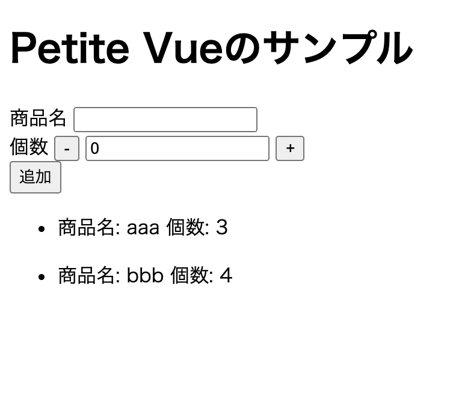

# petite-vueのサンプル
[petie-vue](https://github.com/vuejs/petite-vue) の実際の使用例

## 概要 

 サーバー側でhtmlが生成されるような場合にUIに挙動をつけたい場合にpetite-vueが便利です。
今回はSpring Boot + thymeleafでできた簡易なアプリケーションにて
一部フォームのデータをボタンで制御できるようにしています。
